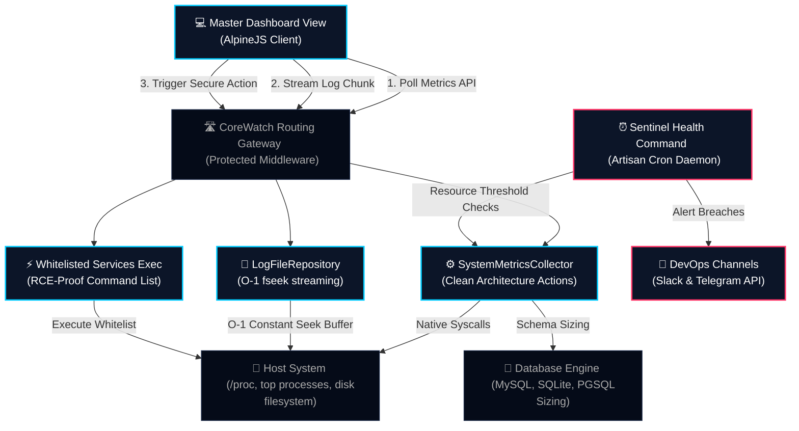

<div align="center">
<h1>Laravel CoreWatch 🛡️</h1>
<p><strong>Embedded DevOps dashboard for Laravel — monitor, debug, and operate your server without leaving your app</strong></p>

<p>
<a href="https://packagist.org/packages/hamzi/corewatch"></a>
<a href="https://github.com/hamdyelbatal122/CoreWatch/actions"></a>
<a href="https://packagist.org/packages/hamzi/corewatch"></a>
<a href="https://packagist.org/packages/hamzi/corewatch"></a>
<a href="https://php.net"></a>
</p>

<p>
<a href="#-quick-start-30-seconds">Quick Start</a> ·
<a href="#-why-corewatch">Why CoreWatch?</a> ·
<a href="#-developer-api-programmatic-access">Developer API</a> ·
<a href="docs/ARCHITECTURE.md">Architecture</a> ·
<a href="docs/FILAMENT.md">Filament</a> ·
<a href="docs/TROUBLESHOOTING.md">Troubleshooting</a>
</p>
</div>

---

> [!IMPORTANT]
> **CoreWatch** is a zero-dependency, self-contained server monitoring utility built for production Laravel systems. No Netdata, no Grafana agent, no external daemon — just `composer require` and you have a full DevOps terminal inside your admin panel.

---

## 🤔 Why CoreWatch?

| Problem | CoreWatch Solution |
| :--- | :--- |
| "I need server metrics but don't want another daemon" | Reads `/proc` directly — zero external processes |
| "Log files are 5GB and crash my log viewer" | O(1) memory backward-seeking parser streams any file size |
| "I'm afraid of RCE in admin panels" | Whitelisted command keys only — no raw shell input |
| "I use Filament/Nova and need embedded monitoring" | Livewire component + modular Blade partials |
| "I need alerts when CPU/RAM spikes" | Scheduled sentinel with Slack, Telegram, or custom events |
| "Load balancer needs a health endpoint" | `GET /corewatch/api/health` returns 200/503 |

### CoreWatch vs. Alternatives

| Feature | CoreWatch | Netdata | Laravel Telescope | Grafana Agent |
| :--- | :---: | :---: | :---: | :---: |
| Zero external daemon | ✅ | ❌ | ✅ | ❌ |
| Server metrics (CPU/RAM/Disk) | ✅ | ✅ | ❌ | ✅ |
| Log file streaming | ✅ | ❌ | ❌ | ❌ |
| Safe ops panel | ✅ | ❌ | ❌ | ❌ |
| Laravel-native install | ✅ | ❌ | ✅ | ❌ |
| Filament/Livewire embed | ✅ | ❌ | ❌ | ❌ |
| Built-in alerting | ✅ | ✅ | ❌ | ✅ |

---

## ⚡ Quick Start (30 seconds)

```bash
composer require hamzi/corewatch
php artisan corewatch:install
```

Open **`/corewatch`** in your browser. That's it.

For production, add `auth` middleware in `config/corewatch.php` and schedule health checks:

```php
// routes/console.php
Schedule::command('corewatch:check-health')->everyFiveMinutes();
```

---

## 🗺️ System Architecture Flowchart

The following diagram illustrates how CoreWatch isolates data collection, streams log buffers, routes controller requests, and schedules alerting triggers:



---

## 🏗️ Package Architecture (Clean Architecture)

CoreWatch follows layered architecture with clear separation of concerns:

```
src/
├── Contracts/          # Interfaces (DIP — depend on abstractions)
├── Domain/             # Business rules (Alert VO, HealthThresholdEvaluator)
├── Application/        # Use cases (Actions) + DTOs
├── Infrastructure/     # Collectors, Repositories, Notifications, Shell
├── Http/               # Controllers, Middleware, Form Requests
├── Console/            # Artisan commands (thin — delegate to Actions)
└── Livewire/           # UI embedding component
```

| Layer | Responsibility | Example |
| :--- | :--- | :--- |
| **Contracts** | Define abstractions | `SystemMetricsCollectorInterface` |
| **Domain** | Pure business logic | `HealthThresholdEvaluator` |
| **Application** | Orchestrate use cases | `GetServerMetricsAction` |
| **Infrastructure** | External I/O | `LogFileRepository`, `CpuMetricsCollector` |
| **Http** | HTTP boundary | `DashboardController` (thin) |

---

## 🧱 Modular `@include` Partial Architecture

CoreWatch separates all diagnostics into elegant, self-contained monospace tables inside `resources/views/partials/`. This modular structure allows clients to easily publish views and include specific tables anywhere inside their custom dashboards:

| Partial Blade View Path | Diagnostic Target | Layout Display Style | Customization Purpose |
| :--- | :--- | :--- | :--- |
| `partials.cpu` | CPU Cores & Load averages | Monospace UNIX Table | Monitor core load thresholds (1M, 5M, 15M) |
| `partials.ram` | Physical Memory (RAM) Allocation | Monospace Memory Table | Track active, free, and cached allocation bytes |
| `partials.disk` | Disk Storage Saturated Volumes | Saturated Space Table | Monitor root storage partition size limits |
| `partials.processes` | Active CPU Top Linux Processes | Live CLI System Table | Identify high CPU usage processes (PID, User) |
| `partials.database` | Database Engine & Schema size | Monospace DB Status Table | Track table counts and database file sizes |
| `partials.app-checks` | Operational Application Integrity | Status Indicator List | Verify Cache, Queue, and Security modes |
| `partials.specifications` | OS Kernel & Laravel specifications | Static Specs Table | Quick access to PHP, OS, and server version info |
| `partials.services` | Whitelisted system task controls | Command Action Table | Safe execution of authorized terminal commands |
| `partials.logs` | Live chunked stream terminal view | Cyberpunk Log Console | View and filter real-time logs with pagination |

---

## ⚡ Key Highlights
1. **Stealthy & Dynamic UI:** Self-contained Blade views styled with a premium Cyberpunk DevOps dark theme. Uses lightweight Tailwind CSS & AlpineJS for dynamic reactivity without bundler dependencies.
2. **Zero-overhead Log Viewer:** An advanced, memory-efficient backward-seeking chunked file parser that streams Laravel/Nginx/Apache logs without memory exhaustion even on multi-gigabyte files.
3. **Advanced System Diagnostics:** Native `/proc` filesystem parsing coupled with fast system command fallbacks to deliver instant CPU, RAM, Disk, and system uptime metrics.
4. **Pre-Whitelisted Services Controller:** Safe administrative triggers (e.g. queue restart, redis flush, cache clearing) mapping to strict command keys preventing arbitrary RCE vulnerabilities.
5. **Top Active CPU Processes:** Live sorted process statistics terminal displaying CPU load, RAM allocation, PID, user, and running commands on Linux hosts.
6. **Database Telemetry Widget:** Direct schema capacity details, connection indicators, and tables count monitoring for MySQL, PostgreSQL, and SQLite database connection engines.
7. **App Integrity Checks:** Automated operational verification for Cache drivers, Artisan Queue connections, Environment status, and Security debug mode states.
8. **Livewire Embed Support:** Built-in dynamic Livewire component (`livewire:corewatch-dashboard`) for drag-and-drop embedding inside administrative panels like **Filament** and **Laravel Nova**.
9. **Continuous Sentinel Daemon:** Scheduled console monitor (`corewatch:check-health`) that alerts your DevOps channels (Slack & Telegram) when resource thresholds are breached.
10. **Developer Facade API:** `CoreWatch::metrics()`, `CoreWatch::health()`, and `ThresholdBreached` events for custom integrations.
11. **One-Command Install:** `php artisan corewatch:install` publishes config and prints your production checklist.
12. **Health Probe Endpoint:** `GET /corewatch/api/health` for uptime monitors, load balancers, and Kubernetes liveness probes.

---

## 🛠️ Installation & Setup

### Production Install (Packagist)

```bash
composer require hamzi/corewatch
php artisan corewatch:install
```

### Publish Views (Optional — for customization)

```bash
php artisan corewatch:install --views
# or manually:
php artisan vendor:publish --tag=corewatch-views
```

### Local Development (Path Repository)

```json
"repositories": [{ "type": "path", "url": "../CoreWatch" }]
```

```bash
composer require hamzi/corewatch:dev-main
php artisan corewatch:install
```

---

## 🔌 Flexible Dashboard Integration Options

CoreWatch is designed to fit seamlessly wherever your administration operations are managed:

> [!TIP]
> Make sure to wrap any custom page elements that use these modular tables inside the parent AlpineJS data controller: `<div x-data="corewatchDashboard()">...</div>`.

### Option A: Standalone Routed View
Once active, navigate directly to `/corewatch` to view the comprehensive Cyberpunk DevOps terminal.

### Option B: Modular Table Includes
Publish the views and embed specific partial views inside your existing administrative panels:

```html
<div x-data="corewatchDashboard()">
    <div class="grid grid-cols-2 gap-4">
        <!-- Render CPU and Database tables directly -->
        @include('corewatch::partials.cpu')
        @include('corewatch::partials.database')
    </div>
</div>
```

### Option C: Blade Custom Component Embeds
Embed the full dashboard seamlessly:

```html
<x-corewatch-views::dashboard />
```

### Option D: Livewire Drag-and-Drop
Embed the Livewire component in Filament dashboards or custom panels:

```html
<livewire:corewatch-dashboard />
```

---

## ⚙️ Threshold Sentinel alerts Alerting

Enable real-time warnings on Slack or Telegram by configuring your host `.env`:

```env
# Slack Alerts Configuration
COREWATCH_SLACK_WEBHOOK_URL="https://hooks.slack.com/services/YOUR_SLACK_WEBHOOK_URL"
COREWATCH_SLACK_CHANNEL="#devops-alerts"

# Telegram Alerts Configuration
COREWATCH_TELEGRAM_BOT_TOKEN="0000000000:AAAAAAAAAAAAAAAAAAAAAAAAAAAAAAAAAAA"
COREWATCH_TELEGRAM_CHAT_ID="-1000000000000"
```

Register the checker command in `routes/console.php` to run every five minutes:

```php
use Illuminate\Support\Facades\Schedule;

Schedule::command('corewatch:check-health')->everyFiveMinutes();
```

---

## 👨‍💻 Developer API (Programmatic Access)

CoreWatch exposes a **Facade** and **Manager** for use in your own code, jobs, and custom admin panels:

```php
use Hamzi\CoreWatch\Facades\CoreWatch;

// Full metrics snapshot
$metrics = CoreWatch::metrics();

// Individual collectors
$cpu  = CoreWatch::cpu();
$ram  = CoreWatch::ram();
$disk = CoreWatch::disk();

// Lightweight health check (for uptime monitors)
$health = CoreWatch::health();
// ['status' => 'healthy', 'healthy' => true, 'checks' => [...], 'timestamp' => '...']

// Read logs programmatically
$logs = CoreWatch::readLogs('laravel', page: 1);

// Run a whitelisted service command
CoreWatch::runService('cache_clear');
```

### Health Endpoint (Uptime Monitors / K8s Probes)

```
GET /corewatch/api/health
```

Returns `200` when healthy, `503` when thresholds are breached. Configure in `.env`:

```env
COREWATCH_HEALTH_ENDPOINT=true
COREWATCH_HEALTH_PUBLIC=false  # Set true for public load-balancer probes
```

### Custom Alert Channels (Events)

Hook into threshold breaches in your `AppServiceProvider`:

```php
use Hamzi\CoreWatch\Events\ThresholdBreached;

Event::listen(ThresholdBreached::class, function (ThresholdBreached $event) {
    // Send to PagerDuty, Discord, email, etc.
    foreach ($event->alerts as $alert) {
        // $alert->name, $alert->current, $alert->severity
    }
});
```

| Guide | Description |
| :--- | :--- |
| [Architecture](docs/ARCHITECTURE.md) | Layer diagram, data flow, and extension guide |
| [Filament Integration](docs/FILAMENT.md) | Embed in Filament admin panels |
| [Troubleshooting](docs/TROUBLESHOOTING.md) | Common issues and fixes |
| [Contributing](CONTRIBUTING.md) | Development workflow and coding standards |
| [Security](SECURITY.md) | Vulnerability reporting policy |

---

## 🔒 Security Practices & Fallbacks
1. **RCE Protection:** CoreWatch never accepts raw input strings to execute shell commands. It maps requests to rigid keys registered in `config/corewatch.php` and blocks any unauthorized requests.
2. **Memory Safety:** The Log Parser uses direct `fseek` backward seeking to stream logs in 64KB blocks, maintaining a strict $O(1)$ memory consumption profile regardless of log file size.
3. **Graceful Fallbacks:** If commands like `exec` or `proc_open` are disabled in `php.ini`, the package falls back to parsing native `/proc` direct files and displays interactive notifications.

---

## 📄 License
The MIT License (MIT). Please see [License File](LICENSE) for more information.

