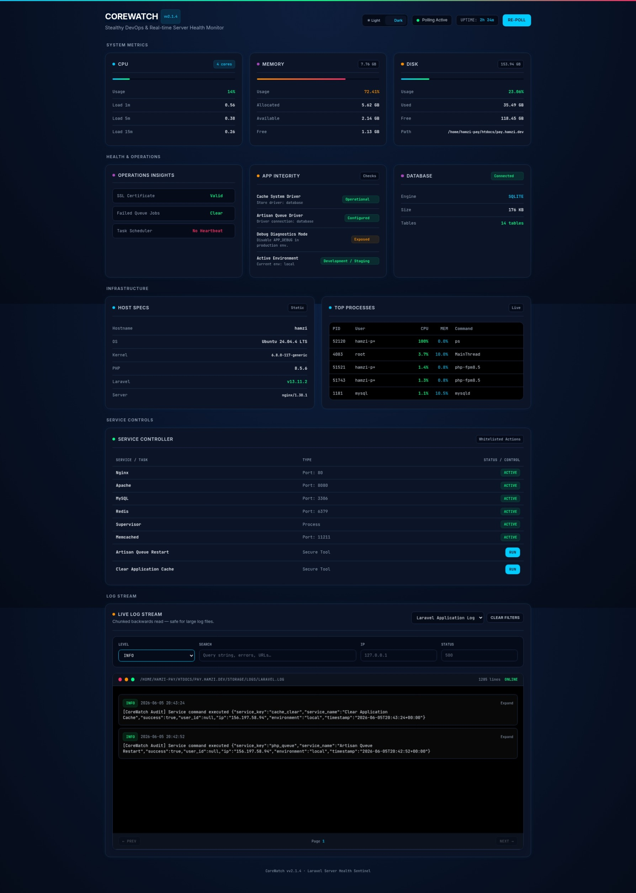
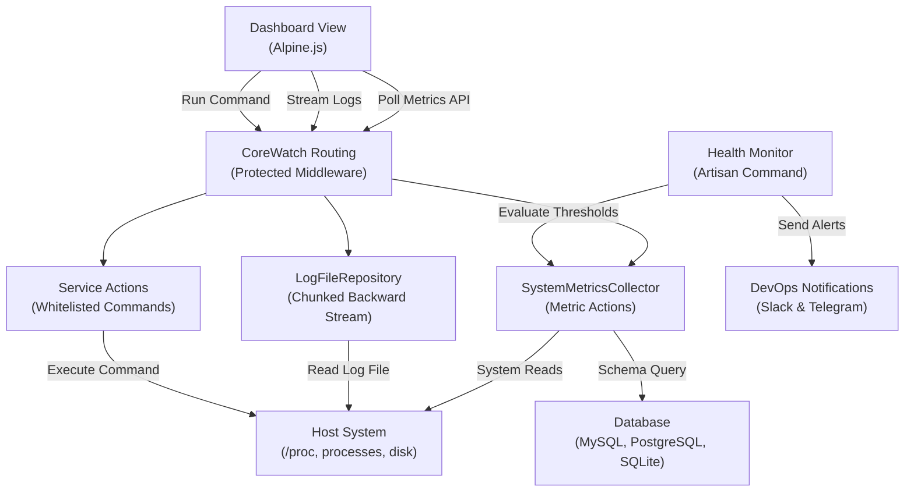

<div align="center">
<h1>Laravel CoreWatch 🛡️</h1>
<p><strong>Embedded DevOps dashboard for Laravel — monitor, debug, and operate your server without leaving your app</strong></p>

<p>
<a href="https://packagist.org/packages/hamzi/corewatch"></a>
<a href="https://github.com/hamdyelbatal122/CoreWatch/actions"></a>
<a href="https://packagist.org/packages/hamzi/corewatch"></a>
<a href="https://packagist.org/packages/hamzi/corewatch"></a>
<a href="https://php.net"></a>
</p>

<p>
<a href="#-quick-start-30-seconds">Quick Start</a> ·
<a href="#-why-corewatch">Why CoreWatch?</a> ·
<a href="#-developer-api-programmatic-access">Developer API</a> ·
<a href="docs/ARCHITECTURE.md">Architecture</a> ·
<a href="docs/FILAMENT.md">Filament</a> ·
<a href="docs/TROUBLESHOOTING.md">Troubleshooting</a>
</p>
</div>

---

> [!IMPORTANT]
> **CoreWatch** is a self-contained server monitoring utility for Laravel applications. It provides real-time system metrics, log streaming, and operational controls without requiring external agents or daemons like Netdata or Grafana.

---

## Why CoreWatch?

| Problem | CoreWatch Solution |
| :--- | :--- |
| "I need server metrics without external daemons" | Reads `/proc` directly — zero background processes |
| "Log files are multi-gigabyte and crash web viewers" | O(1) memory backward-seeking parser streams any file size |
| "I want safe administrative actions without shell risks" | Whitelisted command keys only — no raw shell input accepted |
| "I use Filament or Livewire and need embedded monitoring" | Livewire component and modular Blade partials |
| "I need alerts when CPU or RAM spikes" | Scheduled health check with Slack, Telegram, and custom events |
| "Load balancer needs a health check endpoint" | `GET /corewatch/api/health` returns 200 or 503 |

### CoreWatch vs. Alternatives

| Feature | CoreWatch | Netdata | Laravel Telescope | Grafana Agent |
| :--- | :---: | :---: | :---: | :---: |
| Zero external daemon | ✅ | ❌ | ✅ | ❌ |
| Server metrics (CPU/RAM/Disk) | ✅ | ✅ | ❌ | ✅ |
| Log file streaming | ✅ | ❌ | ❌ | ❌ |
| Safe ops panel | ✅ | ❌ | ❌ | ❌ |
| Laravel-native install | ✅ | ❌ | ✅ | ❌ |
| Filament/Livewire embed | ✅ | ❌ | ❌ | ❌ |
| Built-in alerting | ✅ | ✅ | ❌ | ✅ |

---

## ⚡ Quick Start (30 seconds)

```bash
composer require hamzi/corewatch
php artisan corewatch:install
```

Open **`/corewatch`** in your browser. That's it.

<p align="center">
  
</p>

For production, add `auth` middleware in `config/corewatch.php` and schedule health checks:

```php
// routes/console.php
Schedule::command('corewatch:heartbeat')->everyMinute();
Schedule::command('corewatch:check-health')->everyFiveMinutes();
```

---

## System Architecture
 
The following diagram illustrates how CoreWatch handles data collection, log streaming, and alert dispatching:


```mermaid
graph TD
    A["Dashboard View<br>(Alpine.js)"]
    B["CoreWatch Routing<br>(Protected Middleware)"]
    C["SystemMetricsCollector<br>(Metric Actions)"]
    D["LogFileRepository<br>(Chunked Backward Stream)"]
    E["Service Actions<br>(Whitelisted Commands)"]
    F["Health Monitor<br>(Artisan Command)"]
    
    G["Host System<br>(/proc, processes, disk)"]
    H["Database<br>(MySQL, PostgreSQL, SQLite)"]
    I["DevOps Notifications<br>(Slack & Telegram)"]

    A -->|Poll Metrics API| B
    B --> C
    C -->|System Reads| G
    C -->|Schema Query| H
    A -->|Stream Logs| B
    B --> D
    D -->|Read Log File| G
    A -->|Run Command| B
    B --> E
    E -->|Execute Command| G
    F -->|Evaluate Thresholds| C
    F -->|Send Alerts| I
```

---

## 🏗️ Package Architecture (Clean Architecture)

CoreWatch follows layered architecture with clear separation of concerns:

```
src/
├── Contracts/          # Interfaces (DIP — depend on abstractions)
├── Domain/             # Business rules (Alert VO, HealthThresholdEvaluator)
├── Application/        # Use cases (Actions) + DTOs
├── Infrastructure/     # Collectors, Repositories, Notifications, Shell
├── Http/               # Controllers, Middleware, Form Requests
├── Console/            # Artisan commands (thin — delegate to Actions)
└── Livewire/           # UI embedding component
```

| Layer | Responsibility | Example |
| :--- | :--- | :--- |
| **Contracts** | Define abstractions | `SystemMetricsCollectorInterface` |
| **Domain** | Pure business logic | `HealthThresholdEvaluator` |
| **Application** | Orchestrate use cases | `GetServerMetricsAction` |
| **Infrastructure** | External I/O | `LogFileRepository`, `CpuMetricsCollector` |
| **Http** | HTTP boundary | `DashboardController` (thin) |

---

## 🧱 Modular `@include` Partial Architecture

CoreWatch separates all diagnostics into elegant, self-contained monospace tables inside `resources/views/partials/`. This modular structure allows clients to easily publish views and include specific tables anywhere inside their custom dashboards:

| Partial Blade View Path | Diagnostic Target | Layout Display Style | Customization Purpose |
| :--- | :--- | :--- | :--- |
| `partials.cpu` | CPU Cores & Load averages | Monospace Table | Monitor core load thresholds (1m, 5m, 15m) |
| `partials.ram` | System Memory (RAM) Allocation | Monospace Table | Track allocated, free, and available memory |
| `partials.disk` | Disk Storage & Volumes | Space Usage Table | Monitor root storage partition size limits |
| `partials.processes` | Top Linux processes | Process Table | Identify high CPU & memory processes |
| `partials.database` | Database engine & size | DB Status Table | Track table counts and database size |
| `partials.app-checks` | Application health checks | Status Indicator List | Verify Cache, Queue, and Security modes |
| `partials.specifications` | Host specifications | Specs Table | Display PHP, OS, and server version info |
| `partials.services` | Whitelisted service controls | Action Table | Safe execution of authorized commands |
| `partials.logs` | Live log stream | Log Console | View and filter real-time logs with pagination |

---

## Key Highlights

1. **Light & Dark Theme UI:** Self-contained Blade views with built-in Light and Dark themes. Built with Tailwind CSS and Alpine.js with zero bundler dependencies.
2. **Memory-Safe Log Streaming:** Streams Laravel, Nginx, and Apache log files using backward chunked seeks ($O(1)$ memory usage) even on multi-gigabyte log files.
3. **Low-Overhead System Metrics:** Reads `/proc` directly with shell command fallbacks to report CPU load, RAM allocation, disk capacity, and uptime.
4. **Whitelisted Service Controls:** Safe execution of pre-configured administrative commands (queue restart, cache clearing) mapped to strict keys to prevent arbitrary command execution.
5. **Top Active Processes:** Displays active Linux processes sorted by CPU and memory usage with PID and owner.
6. **Database Telemetry:** Shows connection status, table count, and estimated database size for MySQL, PostgreSQL, and SQLite.
7. **Application Integrity Checks:** Verifies cache store, queue driver, environment, and debug mode status.
8. **Livewire & Filament Support:** Includes a Livewire component (`<livewire:corewatch-dashboard />`) for embedding into Filament and custom admin panels.
9. **Scheduled Health Alerts:** Background command (`corewatch:check-health`) that evaluates resource limits and dispatches alerts to Slack, Telegram, or custom event listeners.
10. **Developer Facade API:** Access metrics programmatically via the `CoreWatch` facade (`CoreWatch::metrics()`, `CoreWatch::health()`).
11. **One-Command Install:** `php artisan corewatch:install` publishes configuration and displays a production checklist.
12. **Health Probe Endpoint:** Built-in JSON health endpoint for load balancers (`/corewatch/api/health`) and Prometheus metric exporter (`/corewatch/api/metrics/prometheus`).

---

## 🛠️ Installation & Setup

### Production Install (Packagist)

```bash
composer require hamzi/corewatch
php artisan corewatch:install
```

### Publish Views (Optional — for customization)

```bash
php artisan corewatch:install --views
# or manually:
php artisan vendor:publish --tag=corewatch-views
```

### Local Development (Path Repository)

```json
"repositories": [{ "type": "path", "url": "../CoreWatch" }]
```

```bash
composer require hamzi/corewatch:dev-main
php artisan corewatch:install
```

---

## Integration Options

CoreWatch supports multiple integration methods:

> [!TIP]
> When including modular partials in a custom page, wrap them in the parent Alpine.js controller: `<div x-data="corewatchDashboard()">...</div>`.

### Option A: Standalone Route
Navigate directly to `/corewatch` to access the full dashboard.

### Option B: Modular Partials
Publish the views and embed specific partials inside existing administrative pages:

```html
<div x-data="corewatchDashboard()">
    <div class="grid grid-cols-2 gap-4">
        @include('corewatch::partials.cpu')
        @include('corewatch::partials.database')
    </div>
</div>
```

### Option C: Blade Component
Embed the dashboard view directly:

```html
<x-corewatch-views::dashboard />
```

### Option D: Livewire Component
Embed the Livewire component in Filament dashboards or custom panels:

```html
<livewire:corewatch-dashboard />
```

---

## ⚙️ Thresholds & Alerting

Enable real-time warnings on Slack or Telegram by configuring your host `.env`:

```env
# Slack Alerts Configuration
COREWATCH_SLACK_WEBHOOK_URL="https://hooks.slack.com/services/YOUR_SLACK_WEBHOOK_URL"
COREWATCH_SLACK_CHANNEL="#devops-alerts"

# Telegram Alerts Configuration
COREWATCH_TELEGRAM_BOT_TOKEN="0000000000:AAAAAAAAAAAAAAAAAAAAAAAAAAAAAAAAAAA"
COREWATCH_TELEGRAM_CHAT_ID="-1000000000000"

# Background Queued Delivery (optional: true or specific queue name)
COREWATCH_NOTIFICATIONS_QUEUE=default
```

Register heartbeat and health checks in `routes/console.php`:

```php
use Illuminate\Support\Facades\Schedule;

Schedule::command('corewatch:heartbeat')->everyMinute();
Schedule::command('corewatch:check-health')->everyFiveMinutes();
```

### Diagnostic & Operational Commands

Verify your deployment and alert pipelines via Artisan:

```bash
# Run comprehensive environment and health audit
php artisan corewatch:doctor

# Test alert delivery through configured Slack/Telegram channels
php artisan corewatch:test-alert
```

---

## 👨‍💻 Developer API (Programmatic Access)

CoreWatch exposes a **Facade** and **Manager** for use in your own code, jobs, and custom admin panels:

```php
use Hamzi\CoreWatch\Facades\CoreWatch;

// Full metrics snapshot
$metrics = CoreWatch::metrics();

// Individual collectors
$cpu  = CoreWatch::cpu();
$ram  = CoreWatch::ram();
$disk = CoreWatch::disk();

// Lightweight health check (for uptime monitors)
$health = CoreWatch::health();
// ['status' => 'healthy', 'healthy' => true, 'checks' => [...], 'timestamp' => '...']

// Run system diagnostics
$diagnostics = CoreWatch::doctor();

// Read logs programmatically
$logs = CoreWatch::readLogs('laravel', page: 1);

// Run a whitelisted service command
CoreWatch::runService('cache_clear');
```

### Health Endpoint (Uptime Monitors / K8s Probes)

```
GET /corewatch/api/health
```

Returns `200` when healthy, `503` when thresholds are breached. Configure in `.env`:

```env
COREWATCH_HEALTH_ENDPOINT=true
COREWATCH_HEALTH_PUBLIC=false  # Set true for public load-balancer probes
```

### Prometheus (Grafana / Monitoring)

```
GET /corewatch/api/metrics/prometheus
```

```env
COREWATCH_PROMETHEUS_ENDPOINT=true
COREWATCH_PROMETHEUS_PUBLIC=false
```

### Arabic Localization

```php
// AppServiceProvider or config/app.php
'locale' => 'ar',
```

Publish translations: `php artisan vendor:publish --tag=corewatch-lang`

### Custom Alert Channels (Events)

Hook into threshold breaches in your `AppServiceProvider`:

```php
use Hamzi\CoreWatch\Events\ThresholdBreached;

Event::listen(ThresholdBreached::class, function (ThresholdBreached $event) {
    // Send to PagerDuty, Discord, email, etc.
    foreach ($event->alerts as $alert) {
        // $alert->name, $alert->current, $alert->severity
    }
});
```

| Guide | Description |
| :--- | :--- |
| [Architecture](docs/ARCHITECTURE.md) | Layer diagram, data flow, and extension guide |
| [Filament Integration](docs/FILAMENT.md) | Embed in Filament admin panels |
| [Troubleshooting](docs/TROUBLESHOOTING.md) | Common issues and fixes |
| [Deployment](docs/DEPLOYMENT.md) | Production checklist |
| [Contributing](CONTRIBUTING.md) | Development workflow and coding standards |
| [Security](SECURITY.md) | Vulnerability reporting policy |

---

## 🔒 Security Practices & Fallbacks
1. **RCE Protection:** CoreWatch never accepts raw input strings to execute shell commands. It maps requests to rigid keys registered in `config/corewatch.php` and blocks any unauthorized requests.
2. **Memory Safety:** The Log Parser uses direct `fseek` backward seeking to stream logs in 64KB blocks, maintaining a strict $O(1)$ memory consumption profile regardless of log file size.
3. **Graceful Fallbacks:** If commands like `exec` or `proc_open` are disabled in `php.ini`, the package falls back to parsing native `/proc` direct files and displays interactive notifications.

---

## 📄 License
The MIT License (MIT). Please see [License File](LICENSE) for more information.

